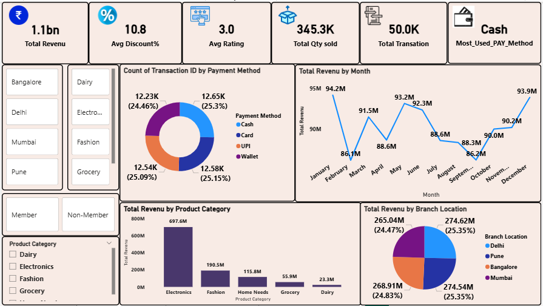
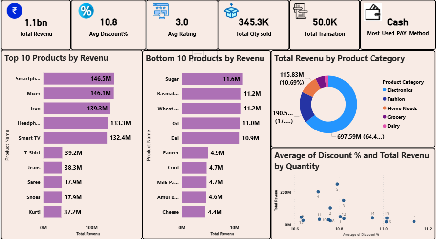
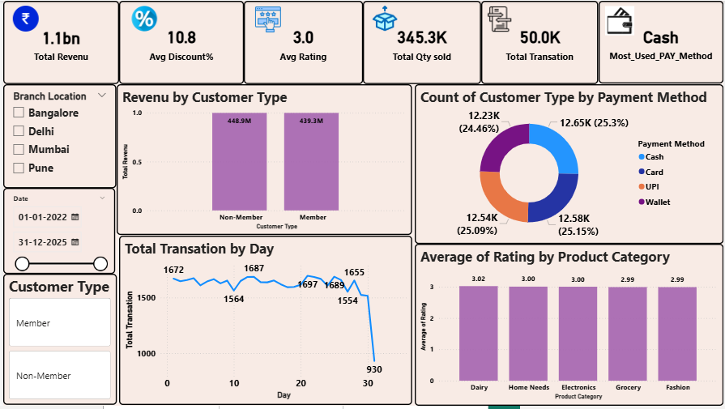

# 📊 Dmart Sales Analysis Dashboard (Power BI)

## 📌 Project Overview

This project presents an interactive Power BI dashboard built to analyze retail sales data from a D-Mart store.

The dashboard helps in understanding:

* Revenue trends
* Customer behavior
* Product performance
* Payment methods

---

## 🛠 Tools Used

* Microsoft Power BI
* Excel / CSV Data

---

## 📊 Dataset

The dataset contains retail transaction data including:

* Order Date
* Product Category
* Product Name
* Quantity
* Revenue
* Discount %
* Payment Method
* Customer Type
* Branch Location

File: `dmart_data.csv`

---

## 📈 Key Insights

* Total Revenue: 1.1B+
* Electronics is the top-performing category
* Cash is the most used payment method
* Balanced contribution across cities (Delhi, Mumbai, Bangalore, Pune)
* Member vs Non-Member revenue comparison

---

## 📷 Dashboard Preview

### 🔹 Business Overview

### 🔹 Product Performance

### 🔹 Customer & Payments

---

## 📁 Files Included

* SalesDashboard.pbix
* dmart_data.csv
* Dashboard images

---

## ▶️ How to Use

1. Download `.pbix` file
2. Open in Power BI Desktop
3. Explore dashboard with filters and slicers

---

## 💡 Features

* KPI Cards (Revenue, Quantity, Transactions)
* Monthly trend analysis
* Top & Bottom products
* Customer segmentation
* Payment method insights
